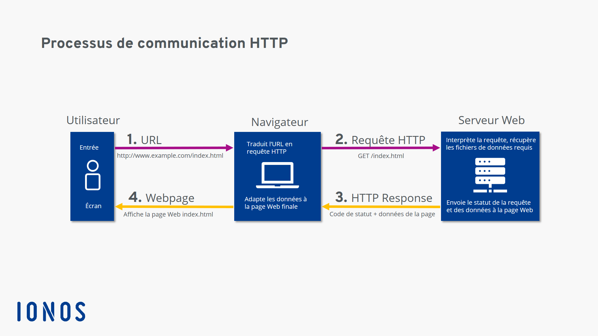

## Protocole HTTP

### Qu'est-ce que le protocole HTTP ?
Le protocole HTTP (HyperText Transfer Protocol) est un protocole de communication client-serveur développé pour le World Wide Web. Il permet de transférer des données hypertextes sur le Web. Il est basé sur le protocole TCP/IP.
Il permet de récupérer des ressources (fichiers, images, sons, vidéos, etc.) sur le Web à partir de leur adresse URL. Il permet également de publier des données sur le Web, par exemple en remplissant des formulaires.

#### Et HTTPS ?
HTTPS (HyperText Transfer Protocol Secure) est une version sécurisée du protocole HTTP. Il utilise le protocole SSL/TLS pour chiffrer les données échangées entre le client et le serveur. Il est utilisé pour sécuriser les transactions financières, les formulaires de connexion, etc.

### Les méthodes HTTP
Les méthodes HTTP sont les actions que l'on peut effectuer sur une ressource. En voici quelques unes :
- GET : récupérer une ressource
- POST : créer une ressource
- PUT : modifier une ressource
- DELETE : supprimer une ressource
- HEAD : récupérer les entêtes d'une ressource
- OPTIONS : récupérer les méthodes HTTP supportées par une ressource
- PATCH : applique une modification partielle à une ressource

### Les codes HTTP
Les codes HTTP sont des codes numériques qui permettent de savoir si une requête a été traitée avec succès ou non. En voici quelques uns :
- 200 : OK
- 201 : Created
- 204 : No Content
- 301 : Moved Permanently
- 304 : Not Modified
- 400 : Bad Request
- 401 : Unauthorized
- 403 : Forbidden
- 404 : Not Found
- 405 : Method Not Allowed
- 500 : Internal Server Error
- 502 : Bad Gateway

### Les entêtes HTTP
Les entêtes HTTP sont des informations supplémentaires qui peuvent être ajoutées à une requête ou à une réponse HTTP. En voici quelques unes :
- Accept-Charset : indique les jeux de caractères acceptés par le client (exemple: utf-8)
- Accept-Encoding : indique les encodages acceptés par le client (exemple: json)
- Accept-Language : indique les langues acceptées par le client (exemple: fr)

### Failles de sécurité
Le protocole HTTP présente plusieurs vulnérabilités et failles de sécurité connues. Voici quelques-unes des failles courantes associées au protocole HTTP :

1. Man-in-the-Middle (MitM) :

Les attaques de type MitM impliquent un tiers malveillant interceptant et potentiellement modifiant la communication entre le client et le serveur. Cela peut compromettre la confidentialité et l'intégrité des données.

2. Attaques par Injection :

Les attaques par injection, telles que les attaques SQL et les attaques XSS (Cross-Site Scripting), peuvent exploiter les entrées utilisateur non validées pour injecter du code malveillant dans les requêtes ou les pages web.

3. Cross-Site Request Forgery (CSRF) :

Les attaques CSRF exploitent la confiance que le site accorde au navigateur de l'utilisateur en envoyant des requêtes non autorisées à un site où l'utilisateur est authentifié, sans son consentement.

4. Cross-Site Scripting (XSS) :

Les attaques XSS consistent à injecter du code JavaScript malveillant dans des pages web consultées par d'autres utilisateurs, compromettant ainsi la sécurité et la confidentialité des données.

Il est essentiel de mettre en œuvre des pratiques de sécurité, d'utiliser HTTPS, de valider les entrées utilisateur, et de suivre les meilleures pratiques de sécurité web pour atténuer ces vulnérabilités.

### Schéma d'une requête HTTP
